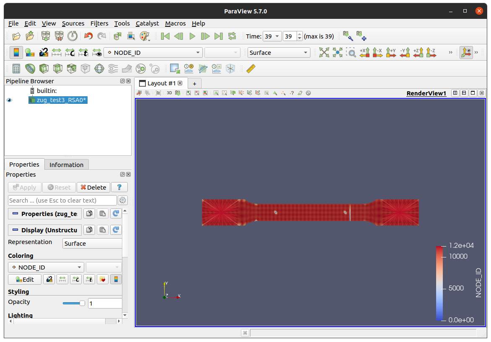
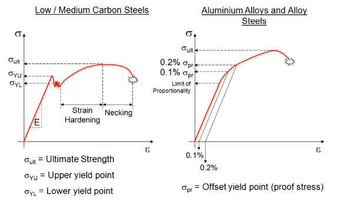
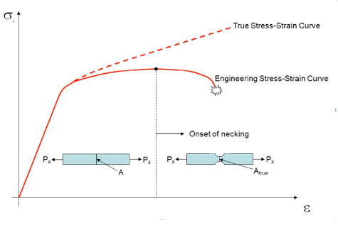
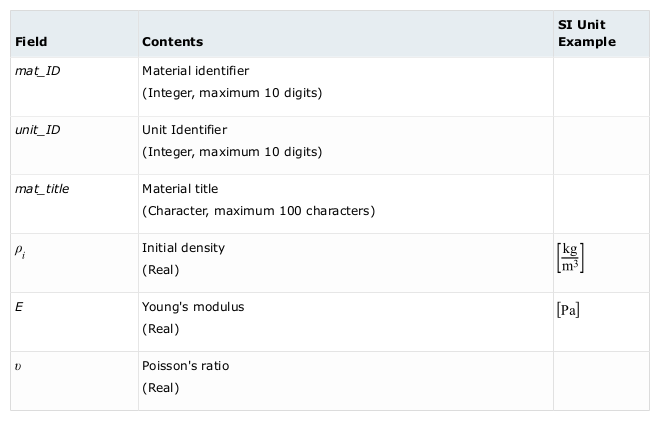

## Linux 下 OpenRadioss 的编译
### 环境
* Ubuntu 20.0.4 or higher
  
           apt-get update
           apt-get upgrade
           apt-get install build-essential
           apt-get install gfortran
           apt-get install cmake
           apt-get install perl
           apt-get install python3
           apt-get install python-is-python3
           apt-get install git-lfs
           apt-get install openmpi-bin openmpi-doc libopenmpi-dev
           apt-get install paraview 

    推荐版本为gcc-11, g++-11, gfortran-11。paraview 用于后期可视化。
    
### 编译指令
#### 获取源码
* LFS: `git lfs install`
* 运行(这里需要先绑定SSH key) `git clone git@github.com:OpenRadioss/OpenRadioss.git`. 

#### OpenRadioss Starter

* 进入 OpenRadioss/starter 目录

            cd OpenRadioss/starter

* 运行 `build_script.sh` 

            ./build_script.sh -arch=linux64_gf

*  `./build_script.sh` 参数:

        []$ ./build_script.sh

         build_script
         ------------
 
         Use with arguments : 
         -arch=[build architecture]
             -arch=linux64_gf  (SMP executable / Gfortran compiler)
         -prec=[dp|sp]                        : set precision - dp (default) |sp 
         -static-link                         : Fortran, C & C++ runtime are linked in binary
         -debug=[0|1]                         : debug version 0 no debug flags (default), 1 usual debug flag 
         -addflag="list of additionnal flags" : add compiler flags to usual set
 
         Execution control 
         -nt=[threads]      : number of threads for build 
         -verbose           : Verbose build
         -clean             : clean build directory

#### OpenRadioss Engine
 
* 进入 OpenRadioss/engine 目录

* 运行`build_script.sh` 
            
            ./build_script.sh -arch=linux64_gf -mpi=ompi
            
*  `./build_script.sh` 参数:

        []$ ./build_script.sh 
         
         build_script
         ------------
 
         Use with arguments : 
         -arch=[build architecture]

                 -arch=linux64_gf               (SMP executable / Gfortran compiler)
                 -arch=linux64_gf -mpi=ompi     (OpenMPI executable / Gfortran compiler)
 
         MPI libraries
         -mpi=[mpi]
                 not set   : SMP (default)
                 -mpi=ompi : OpenMPI
 
                  Controling MPI Libraries - if need choose one of the 3 Option Set
                                             If no options set, recommended OpenMPI directories are uses (default)
                    1. -mpi-os                             : link with default MPI version installed on system
                                                    libraries are in default installation 
                    2. -mpi-root=[directory]               : set rootname to link with specific MPI installation
                    3. -mpi-include=[directory]            : set include directory where to find mpif.h and mpi.h
                       -mpi-libdir=[directory]             : set library directory where to find mpi libraries
 
         Other control
         -prec=[dp|sp]                        : set precision - dp (default) |sp 
         -static-link                         : Fortran, C & C++ runtime are linked in binary
         -debug=[0|1]                         : debug version 0 no debug flags (default), 1 usual debug flag 
         -addflag="list of additionnal flags" : add compiler flags to usual set
 
         Build control 
         -nt=[threads]      : number of threads for build 
         -verbose           : Verbose build
         -clean             : clean build directory
                MUMPS linear solver: available only for dp, with mpi" 
         -mumps_root=[path_to_mumps]          : path_to_mumps/lib/libdmumps.a must exist
         -scalapack_root=[path to scalapack]  : path_to_scalapack/libscalapack.a must exist
         -lapack_root=[path to lapack]  : path_to_lapack/liblapack.a must exist

### 自动化脚本（待定）

        cd starter
        ./build_script.sh -arch=linux64_gf
        cd ../engine
        ./build_script.sh -arch=linux64_gf -mpi=ompi

## OpenRadioss 的使用
### 前处理
* gmsh
* Hypermesh
* lsprepost (*)
### 计算
### 后处理
### 使用 LSDYNA 格式输入 
#### 测试实例
测试例子是[拉伸模拟](https://openradioss.atlassian.net/wiki/spaces/OPENRADIOSS/pages/21364914/Tensile+Test+Model+in+LS-DYNA+format "拉伸-LSDYNA")。
#### bash 脚本

        myjobname=$(echo "$1" )
        echo $myjobname "running in OpenRadioss"
        export OMP_STACKSIZE=400m
        export OMP_NUM_THREADS=8
        ./starter_linux64_gf -i "../source/"$myjobname".k" -np $2 -outfile="../output"
        #./starter_linux64_gf -i $myjobname".k" -np $2 -nt 4
        # 这里是找到source文件夹下的，LS-DYNA 格式文件（.k）并将其传递给starter 进行计算。
        mpiexec -n $2  --map-by socket:PE=$OMP_NUM_THREADS --bind-to core ./engine_linux64_gf_ompi -i "../bin/"$myjobname"_0001.rad" -outfile="../output"
        #mpiexec -n $2 .engine_linux64_gf_ompi -i $myjobname"_0001.rad" -nt 1
        # 在处理.k文件时，starter 会在其目录下生成"_0001.rad"文件，需要将其传递给 engine

        BASEDIR=$(dirname "$0")
        for file in ../output/*; 
        do   
            if [ -n "${file: -3}" ] && [ "${file: -3}" -eq "${file: -3}" ] 2>/dev/null && [[ "${file: -4:1}" == "A" ]]; then
                ./anim_to_vtk_linux64_gf $file > "$file.vtk"
                echo "$file is converted"		
                # anim 文件转化为 vtk 文件
            elif  [[ "${file: -3}" == "T01" ]] ;then
                ./th_to_csv_linux64_gf $file
                CSV="$file.csv"
                # T01 文件转化为 csv 文件
            fi
        done
        cd ../output/
        #paraview $myjobname"A..vtk" $CSV 
        paraview $myjobname"A..vtk" $CSV 
        exit

在命令行输入 `bash process_k.sh zug_test3_RS 1 `即可。其中`process_k.sh`是脚本名字，`zug_test3_RS`是模型名字，`1`是并行进程数。

#### 运行结果

#### 总结
在使用Openadioss 处理LS-DYNA 格式的文件时，需要 .k 文件。这个文件其实是可以直接放在LS-DYNA 上进行计算的。这里提供了一种其他的计算方式——使用OpenRadioss。
#### To Do 
需要验证计算的正确性：也就是使用LS-DYNA计算同样的例子，观察计算结果是否有出入。

* LS-DYNA 是商业软件，能找到的软件不支持 Ubuntu 系统。
    - 可以在windows 下仿真，将结果和进行对比。
* 如何衡量误差
    - 这一部分有很多需要考虑的，比如毁伤面积、毁伤深度。

## 在服务器上运行 OpenRadioss

没有权限。。。 =  = 

## OpenRadioss 二次开发
### READ_MATERIAL_MODELS.F
这段代码定义了一个 Fortran 的子程序 READ_MATERIAL_MODELS，其主要功能是管理与材料模型相关的读取器，包括以下内容：

    材料本构定律（Constitutive Laws）：/MAT
    状态方程（Equations of State）：/EOS
    失效模型（Failure models）：/FAIL
    粘性模型（Viscosity）：/VISC
    热参数（Thermal parameters）：/HEAT

该子程序的输入包括：

    MAT_ELEM：材料元素的参数
    MLAW_TAG：材料本构定律的标签
    FAIL_TAG：失效模型的标签
    VISC_TAG：粘性模型的标签
    EOS_TAG：状态方程的标签
    BUFMAT：材料数据的缓存区
    BUFLEN：缓存区的长度
    IPM：材料参数的整型数组
    PM：材料参数的实型数组
    UNITAB：单位制表
    MULTI_FVM：多重有限体积法的数据结构
    MAXEOS：最大状态方程数
    FAILWAVE：失效波的数据结构
    NLOC_DMG：非局部损伤的数据结构
    LSUBMODEL：子模型的数据结构
    TABLE：表的数据结构
    NPC：数组 NPC

该子程序的输出包括：

    MAT_ELEM：材料元素的参数
    MLAW_TAG：材料本构定律的标签
    FAIL_TAG：失效模型的标签
    VISC_TAG：粘性模型的标签
    EOS_TAG：状态方程的标签

该子程序还调用了其他一些子程序，例如 HM_READ_MAT、HM_READ_EOS、HM_READ_FAIL、HM_READ_VISC、HM_READ_LEAK、READ_ALE_MAT、READ_EULER_MAT、FILL_BUFFER_51_0、HM_READ_THERM、HM_READ_THERM_STRESS 和 HM_READ_NONLOCAL 等，用于读取不同类型的材料模型数据。

接下来考虑分析 `HM_READ_MAT` 程序，分析软件是如何作的。

### HM_READ_MAT.F
这是用于读取有限元分析软件中的材料模型定义的代码。

    它定义了阅读材料模型所需的各种模块、参数和公共块。其中包括材料定律标签、材料参数、单位等。
    主例程是HM_READ_MAT。它循环遍历模型中定义的每种材料 (HM_NUMMAT)。
    对于每种材料，它根据材料定律关键字（MAT00、MAT01 等）调用特定的读取例程。这些读取例程位于 mat 子目录中的单独文件中。
    读取例程解析输入、填充材料参数数组、设置材料所需数据的标志，并存储材料 ID、定律类型、应变率设置等内容。
    读取材料后，它会进行一些后处理，例如计算派生值（剪切模量）、检查重复 ID 以及计算输出所需数量的平方根。
    每种材料的属性存储在 MAT_PARAM 数组和各种其他公共块中。

总之，它循环遍历材料，调用特定于定律的读取器，并将所有材料数据收集到参数数组和通用块中，以便稍后在 FEA 分析中使用。关键部分是模块化法则读取器和用于保存材料道具的中央 MAT_PARAM 数据结构。

* 因此，想要定义全新的材料，所要做的事情是自定义MATxxx文件。

### Radioss 中材料本构
#### 各向同性弹性
| Description     | Model Name | Keyword/MAT|Law#|
| ----------- | ----------- |---|---|
|空材料|Void|/VOID| 0|
|线弹性|Elastic (Hooke)|/ELAST|1|
|超弹性|Tabulated Hyperelastic|n/a|69|
|超弹性|Ogden Formulation|n/a|82|
#### 各项同性弹塑性
LAW 2 / 36
#### 其他
#### 爆炸
| Description     | Model Name | Keyword/MAT|Law#|
| ----------- | ----------- |---|---|
|Detonation driven|Jones Wilkins Lee|/JEL|5|
|Hydrodynamics|Lee-Tarver|/LEE-TARVER|41|
|Multi-materials|Soild, liquid,gas and explosives|/MULTIMAT|51|
#### 失效模型——/FAIL
/Tuler-Butcher 高速碰撞失效
### 例子——/MAT/LAW1或/MAT/ELAST: 弹性材料
* LAW1 使用胡克定律对各向同性，线弹性材料进行建模
* 可用于杆，梁，壳以及实体solids
* 适用于连接刚体
* 不适用形变大的构件

弹塑性应力——应变曲线

真实应力形变
* 真实应力：考虑当前或真实横截面积$A_{true}$的应力
  $$\sigma_{true}=\frac{P_x}{A_{true}}$$
* 在塑性变形范围内，塑性变形横截面积永久减小
* 继续使用工程应力不再准确
 

 #### MAT1 定义方式
 这个关键词用胡克定律定义了一种各向同性的线弹性材料。这个定律表示应力和应变之间的线性关系。它可用于桁架，梁(仅3型)，壳和实体元件。
 格式
 
 定义
 
 例子
 

 原理：
  
* 该材料适用于纯粹的弹性材料。材料的性能只取决于两个因素：
  * 杨氏模量: $E$
  * 泊松比: $\nu$
  * 剪切模量: (可计算) $$G=\frac{E}{2(1+\nu)}$$
* 应力应变关系
  $$\begin{bmatrix}
  \epsilon_{11}\\
  \epsilon_{22}\\
  \epsilon_{33}\\
  \gamma_{23}\\
  \gamma_{31}\\
  \gamma_{12}
  \end{bmatrix}=\frac{1}{E}
  \begin{bmatrix}
    1&-\nu&-\nu&0&0&0\\
    -\nu&1&-\nu&0&0&0\\
    -\nu&-\nu&1&0&0&0\\
    0&0&0&2(1+\nu)&0&0\\
    0&0&0&0&2(1+\nu)&0\\
    0&0&0&0&0&2(1+\nu)
  \end{bmatrix}
  \begin{bmatrix}
    \sigma_{11}\\
    \sigma_{22}\\
    \sigma_{33}\\
    \sigma_{23}\\
    \sigma_{31}\\
    \sigma_{12}
  \end{bmatrix}$$
* 密度值通常用于显式模拟，也可以用于静态隐式模拟，以便在拟静态分析中达到更好的收敛性。
* 当通过壳体厚度的积分点个数不同于NP=1(膜)时，对LAW1和壳单元(/PROP/TYPE1 (shell))采用全局积分法。
* 失效模型在全局集成的情况下不可用。在这些情况下，具有很高屈服应力的LAW2和LAW27可以作为LAW1的替代品。
 #### MAT1 代码解读
 总体框架是
 * 获取输入
  
        CALL HM_OPTION_IS_ENCRYPTED(IS_ENCRYPTED)
        CALL HM_GET_FLOATV('MAT_RHO',  RHO0  ,IS_AVAILABLE,LSUBMODEL,UNITAB)
        CALL HM_GET_FLOATV('Refer_Rho',RHOR  ,IS_AVAILABLE,LSUBMODEL,UNITAB)
        CALL HM_GET_FLOATV('MAT_E',    YOUNG ,IS_AVAILABLE,LSUBMODEL,UNITAB)
        CALL HM_GET_FLOATV('MAT_NU',   ANU   ,IS_AVAILABLE,LSUBMODEL,UNITAB)
 * 计算参数

            IF(RHOR == ZERO ) RHOR=RHO0
        C
            IF (YOUNG<=ZERO) THEN
                CALL ANCMSG(MSGID=683,
            .                MSGTYPE=MSGERROR,
            .                ANMODE=ANINFO,
            .                I1=ID,
            .                C1=TITR,
            .                C2='YOUNG''S MODULUS')
            ENDIF
            IF(ANU==HALF)ANU=ZEP499                  
        C
            G=YOUNG/(TWO*(ONE+ANU))
            C0=ZERO
            C1=YOUNG/(THREE*(ONE-TWO*ANU))
            E0=ZERO
            E1MN2=YOUNG/(ONE-ANU**2)
            EN1N2=ANU*E1MN2
            SDSP =SQRT(YOUNG/MAX(RHOR,EM20))
            ISRATE = 0 
 * 保存参数
  
        PM(1) =RHOR
        PM(20)=YOUNG
        PM(21)=ANU
        PM(22)=G
        PM(23)=E0
        PM(24)=E1MN2
        PM(25)=EN1N2
        PM(26)=FIVE_OVER_6
        PM(27)=SDSP
        PM(31)=C0
        PM(32)=C1
        PM(89) =RHO0

 * 异常处理

        c-----------------
            CALL INIT_MAT_KEYWORD(MATPARAM,"TOTAL")
            IF (ANU > 0.49) THEN
                CALL INIT_MAT_KEYWORD(MATPARAM,"INCOMPRESSIBLE")
            ELSE
                CALL INIT_MAT_KEYWORD(MATPARAM,"COMPRESSIBLE")
            END IF
            CALL INIT_MAT_KEYWORD(MATPARAM,"HOOK")
        c-----------------
            WRITE(IOUT,1001) TRIM(TITR),ID,01
            WRITE(IOUT,1000)
            IF(IS_ENCRYPTED)THEN
                WRITE(IOUT,'(5X,A,//)')'CONFIDENTIAL DATA'
            ELSE
                WRITE(IOUT,1100)RHO0
                WRITE(IOUT,1300)YOUNG,ANU,G
            ENDIF
        C
            IPM(252)= 2
            PM(105) = TWO*G/(C1+FOUR_OVER_3*G)
        C-----------
 * 控制输出
  
        C-----------
            RETURN
        1000 FORMAT(
            & 5X,'  ELASTIC MATERIAL (/MAT/LAW01)',/,
            & 5X,'  -----------------------------')
        1001 FORMAT(
            & 5X,A,/,
            & 5X,'MATERIAL NUMBER . . . . . . . . . . . .=',I10/,
            & 5X,'MATERIAL LAW. . . . . . . . . . . . . .=',I10/)
        1100 FORMAT(
            & 5X,'INITIAL DENSITY . . . . . . . . . . . .=',1PG20.13/) 
        1300 FORMAT(
            & 5X,'YOUNG''S MODULUS . . . . . . . . . . . .=',E12.4/,
            & 5X,'POISSON''S RATIO . . . . . . . . . . . .=',E12.4/,
            & 5X,'SHEAR MODULUS . . . . . . . . . . . . .=',E12.4//)

在数据里最重要的是 `PM` 以及 `IPM` ，分别存储了材料参数和材料 ID。但是暂时没有相关文档说明其具体内容。提取 mat 文件夹下所有 PM 变量的信息汇总如下: 

        PM(1) = RHO0
        PM(1)      = RHOR
        PM(1) = RHOR
        PM(01) = RHOR
        PM(1)  = RHOR
        PM(01) = RHO0
        PM(01)=RHOR
        PM(1) = RHO0  ! RHOR
        PM(1)   = RHO0
        PM(1)=RHOR
        PM(1) =RHOR
        PM(1)  = RHO0
        PM(2)  = GS
        PM(8) =ISRATE
        PM(9) = TWO*PI *FCUT
        PM(9) =FCUT*TWO*PI
        PM(9)  = FCUT*TWO*PI
        PM(9) = ASRATE
        PM(12) = SQRT(MAX(ZERO, G0)) !done by default in lecmuser.F for law34
        PM(17) = MU
        PM(17) = AMU
        PM(20)= MAX(E11,E22)/DETC
        PM(20) = MW
        PM(20) = STIFF        ! Stiffness contact
        PM(20)= CMAX / TWO
        PM(20) = YMC
        PM(20)=NMAT+EM01
        PM(20)= YOUNG
        PM(20) = NBMAT + EM01
        PM(20)= MAX(E11,E22,E33)
        PM(20)=YOUNG
        PM(20)=E
        PM(20) = MAX(E11,E22)/DETC
        PM(20) = YOUNG
        PM(21) = ANUC
        PM(21) = ZERO         ! NU
        PM(21)=NU
        PM(21)= ANU
        PM(21)=ANU
        PM(21)= NU
        PM(21) = SQRT(N12*N21)
        PM(21) = NUG
        PM(21) = NU
        PM(21) = CPA
        PM(21)= THIRD*(N12+N31+N23)
        PM(22) = G0
        PM(22) = YMC/(TWO*(ONE+ANUC))
        PM(22) = GS !! TWO*G
        PM(22)=G
        PM(22)= G
        PM(22) = STIFF*HALF   ! GMAX
        PM(22) = CPB
        PM(22) = G
        PM(22)= THIRD*(G12+G23+G31)
        PM(22) = GS
        PM(22) = MAX(G12,G23,G31)
        PM(23) = YOUNG
        PM(23)= E0
        PM(23) = CPC
        PM(23) = EM01*STIFFAVG  ! Hourglass stiffness for QEPH
        PM(23) = E0
        PM(23) = ZERO ! E0
        PM(23)  = E0
        PM(23)=E0
        PM(24)= PM(20)
        PM(24) = NU * YOUNG / (ONE-NU*NU)
        PM(24) = YOUNG/(ONE - NU**2)
        PM(24)= CMAX/(ONE - NU**2) / TWO
        PM(24) = PM(25) + TWO*PM(22)
        PM(24) = E1MN2
        PM(24) = STIFF        ! Stiffness for time step computation
        PM(24)=D2
        PM(24) = YOUNG/(ONE - NUG**2)
        PM(24)=E1MN2
        PM(24)=VIS
        PM(24) = PM(20)
        PM(24) = CPD
        PM(25)  = GAM
        PM(25)=D3
        PM(25)=NR
        PM(25)=EN1N2
        PM(25) = CPE
        PM(25) = YMC*ANUC/(ONE+ANUC)/(ONE-TWO*ANUC)
        PM(25)= 1.
        PM(25) = EN1N2
        PM(25) = PM(21)*PM(24)
        PM(26)=FIVE
        PM(26) = FIVE_OVER_6
        PM(26) = CPF
        PM(26)=PM(26)*ONE_OVER_6
        PM(26)=NT
        PM(26)=THET
        PM(26)=FIVE_OVER_6
        PM(26)= CB
        PM(26) = MAX(ZERO,DSUP1)
        PM(27) = SQRT(A11/RHO0)  ! sound speed estimation
        PM(27) = SQRT(YOUNG/RHO0)  ! Sound speed
        PM(27)=D
        PM(27) = SSP
        PM(27) = SDSP
        PM(27)=SDSP
        PM(27)= CN
        PM(27) = SQRT(A1/RHO0)  ! sound speed estimation
        PM(27)= SSP
        PM(27)  = VCRT2
        PM(27) = SQRT(E/MAX(RHOR,EM20))
        PM(27)=APY
        PM(27) = SQRT((BULK + FOUR_OVER_3*G)/RHO0)  ! sound speed estimation
        PM(27) = MAXVAL(SSP(1:4))
        PM(27)=IDF
        PM(27) = R_IGC1
        PM(27)= SQRT(E/RHO0)  ! Sound speed for beam elements
        PM(27) = VMAX
        PM(27)  = D
        PM(28) = MAX(ONEP0001,FMAX)
        PM(28) = ONE/YOUNG
        PM(28)  = GAMRP
        PM(28) = ONE-HT/YMC
        PM(28)=VB
        PM(28) = MAX(ONEP0001,(SIGMX/CA)**2)
        PM(28)=ONE/YOUNG
        PM(28)=NR
        PM(29)=-ANU*PM(28)
        PM(29) = -NU*PM(28)
        PM(29)  = GAM1
        PM(29) = ROK
        PM(29)=NT
        PM(29)=TM0
        PM(30)=ONE/G
        PM(30)=IDF
        PM(30) = ONE/G
        PM(30)=E00
        PM(30) = RO0
        PM(31)=ZERO
        PM(31) = -PSH + C0+C1*MU+         C3*MU**3+(C4+C5*MU)*E0
        PM(31) = ZERO ! C0
        PM(31)= C0
        PM(31)= ZERO
        PM(31) = -PSH + C0+C1*MU+C2*MU**2+C3*MU**3+(C4+C5*MU)*E0
        PM(31)=C0
        PM(31) = P0+PSHIFT
        PM(31)=P0
        PM(31)  = C0-PSH
        PM(31)  = P0
        PM(31)= C0-PSH
        PM(32)  = C1
        PM(32)= RBULK
        PM(32)= RHOR*C**2
        PM(32)=C1
        PM(32) = RBULK
        PM(32) = BULK
        PM(32)=BULK
        PM(32)= C1
        PM(32) = GS
        PM(32) = C1
        PM(33)=ZERO
        PM(33)= C2
        PM(33) = E11
        PM(33)= SIGT1
        PM(33)=E11
        PM(33)=C
        PM(33)=C2
        PM(33)  = A
        PM(33) = FC
        PM(33)  = RE0/RHO0
        PM(34)=E22
        PM(34) = E22
        PM(34)= SIGT2
        PM(34)=ZERO
        PM(34)  = B
        PM(34)  = -HALF*SSP2/CARL**2
        PM(34)=C3
        PM(34)=S
        PM(34)= C3
        PM(34) = RT
        PM(35)=PCC
        PM(35) = RC
        PM(35)=N12
        PM(35) = N12
        PM(35)=C4
        PM(35)=BUNL
        PM(35)= C4
        PM(35)=XKL
        PM(35)  = R1
        PM(35)= SIGT3
        PM(35)=ZERO
        PM(36)=XMUMX
        PM(36)=ZERO
        PM(36) = N21
        PM(36)= C5
        PM(36)=N21
        PM(36)=GAM0
        PM(36)=C5
        PM(36) = RT*(TWO*RC-RT)
        PM(36)  = R2
        PM(36)=XLAMB
        PM(36)= EFIB
        PM(37)=-INFINITY
        PM(37) = G12
        PM(37)= EPSFT
        PM(37)  = -PSH
        PM(37)= PMIN
        PM(37)=PMIN
        PM(37) = (RC-RT)**2
        PM(37)  = EF
        PM(37)=G12
        PM(37) = PMIN
        PM(37)=ATOM
        PM(38) = UPARAM(42)  !VDET
        PM(38)=G23
        PM(38) = AA
        PM(38) = CA
        PM(38)= EPSFC
        PM(38)=CA
        PM(38)        = D
        PM(38)=A0
        PM(38)= CA
        PM(38)  = D
        PM(38) = G23
        PM(38)= EFIB
        PM(38)=VDET
        PM(38) = SIG0
        PM(39)=CB
        PM(39)= ALPHA
        PM(39) = CB
        PM(39)=G31
        PM(39)=A1
        PM(39)= CB
        PM(39) = BC
        PM(39) = G31
        PM(39)=CE
        PM(39)  = PCJ
        PM(40)=A2
        PM(40) = BT
        PM(40)  = ONE/TSCAL
        PM(40) = CN
        PM(40)  = PM(1)*D**2/PCJ
        PM(40) = IFLAG
        PM(40)=CN
        PM(40)= CN
        PM(40)= D11
        PM(41) = EPSM
        PM(41)= D12
        PM(41)  = IBFRAC
        PM(41) = TIMESCAL
        PM(41)= EPSM
        PM(41)=AMX
        PM(41) = AC
        PM(41) = EP20 ! EPSM
        PM(41) = WPLAMX
        PM(41)=EPSM
        PM(41)=WPLAMX
        PM(42)  = QOPT
        PM(42)=IOFF
        PM(42)=SIGM
        PM(42)= D13
        PM(42) = IOFF
        PM(42) = TSCAL
        PM(42)=FAC_Y
        PM(42) = SIGM
        PM(42) = FT*FC/YMC
        PM(42)= SIGM
        PM(43)=CC
        PM(43)=CM
        PM(43) = HBP
        PM(43)  = C0
        PM(43)= CC
        PM(43)= D22
        PM(43) = CB1
        PM(43) = CC
        PM(43)=PEXT
        PM(43) = ESCAL
        PM(44)=EPS0
        PM(44) = DE
        PM(44)=PSTAR
        PM(44) = EPS0
        PM(44)= D23
        PM(44) = CB2
        PM(44)=DE
        PM(44) = KSCAL
        PM(44)  = BULK
        PM(44) = RCOMP
        PM(44) = ALI
        PM(44)= EPS0
        PM(45)  = W
        PM(45) = ALF
        PM(45) = CH
        PM(45)=BUNL
        PM(45)= CM
        PM(45)= D33
        PM(45)=EPSL
        PM(45)=CM
        PM(45)=A11
        PM(46) = TMELT
        PM(46)=CB
        PM(46)=SSL
        PM(46)=XMUMX
        PM(46)= G12
        PM(46)=A22
        PM(46)=TMELT
        PM(46)= TMELT
        PM(46) = CB
        PM(46) = VKY
        PM(46)=HL
        PM(47)=TMAX
        PM(47)=A*AK
        PM(47)=CN
        PM(47)=ZERO ! MUMIN
        PM(47) = CN
        PM(47) = EPSMAX
        PM(47)= TMAX
        PM(47)=YLDL
        PM(47)=A1122
        PM(47)= G23
        PM(48)=E
        PM(48)=A
        PM(48)= G31
        PM(48)=A12
        PM(48)=IFORM
        PM(48)=NR
        PM(48)=CS
        PM(48)=EL
        PM(48) = HV0
        PM(49)=A
        PM(49) = EXPO
        PM(49)=FMAX
        PM(49)=GAM0M
        PM(49) = ICC
        PM(49)=ICC
        PM(49)= SSP
        PM(49) = FMAX
        PM(49)=C0
        PM(49)=NT
        PM(50)=AM
        PM(50)=B
        PM(50)=ZERO
        PM(50) = YMS
        PM(50)=IDF
        PM(50)=CC
        PM(50)  = ITYP
        PM(50)=ONE
        PM(51)=SIG
        PM(51)=MT
        PM(51)=EPS0
        PM(51) = Y0S
        PM(51)  = INOD ! USR2SYS APRES FSDCOD, IF(IFORM8==2) INOD=USR2SYS(INOD,ITABM1,MESS)
        PM(51)=GAME
        PM(51)=C3
        PM(51)=YP1
        PM(52)=GP
        PM(52)=ONEP414*PM(17)*PM(1)*SSP
        PM(52)=ICC
        PM(52)=C4
        PM(52)=TM
        PM(52)=XKMAX
        PM(52) = ONEP414*MU*PM(1)*SDSP
        PM(52)=ONEP414*AMU*PM(1)*SDSP
        PM(52) = ETS
        PM(53)=ICC
        PM(53)=F1
        PM(53)=ONE/CP
        PM(53)=DSP
        PM(53) = ARM1
        PM(53)   = AREAMIN1
        PM(53)=ZERO
        PM(54)=E0H
        PM(54)=F2
        PM(54) = ARM2
        PM(54) = ZERO
        PM(54)=F1
        PM(54) = ONE / (AREAMIN2-AREAMIN1)
        PM(54)=TI
        PM(55)=FISOKIN
        PM(55)=RP3
        PM(55)=F3
        PM(55)=F2
        PM(55) = ARM3
        PM(56)=F4
        PM(56) = ONE      !
        PM(56) = POROSITY
        PM(56)=VJ
        PM(56)=F11
        PM(57)=F5
        PM(57)=C1
        PM(57) = ICAP+EM01
        PM(57)=F22
        PM(58)=C2
        PM(58)=F33
        PM(58)=F6
        PM(58) = ONE-HVFAC
        PM(59)=F11
        PM(59) = ZERO    !
        PM(59)=F12
        PM(59)=F1
        PM(59)=C3
        PM(59)=ALPHA
        PM(60)=F22
        PM(60)= BETA
        PM(60)=EPST1
        PM(60)=D1
        PM(60) = EPST1
        PM(60)=F2
        PM(61)= TMAX
        PM(61)=ALPHAP
        PM(61) = EPST2
        PM(61)=EPST2
        PM(61)=F33
        PM(61)=F4
        PM(62)=F5
        PM(62)=F44
        PM(62)=EPSM1
        PM(62) = EPSM1
        PM(63)=F11
        PM(63)=EPSM2
        PM(63)=F55
        PM(63) = EPSM2
        PM(64) = DMAX1
        PM(64)=F22
        PM(64)=DMAX
        PM(64)=F66
        PM(65)=SHRDAM
        PM(65) = DMAX2
        PM(65)=F12
        PM(65)=F44
        PM(66) = EPSF1
        PM(66)= F23
        PM(66)=SHRMAX
        PM(66)=F55
        PM(67)= F13
        PM(67)=SHRDMAX
        PM(67)=F12
        PM(67) = EPSF2
        PM(68)=WPLAREF
        PM(68)=F23
        PM(69)=SPH
        PM(69) = SPH
        PM(69) = RCP
        PM(69)=C11
        PM(70)=ZERO
        PM(71) = JTHE+EM01
        PM(72) = ZERO
        PM(72)=ZERO
        PM(73)=C22
        PM(73)=C11
        PM(74)=C33
        PM(74)=C22
        PM(75) = AS
        PM(75)=C12
        PM(75)=C33
        PM(76)=C23
        PM(76) = BS
        PM(76)=C12
        PM(77)=C13
        PM(77)=C23
        PM(77) = CF
        PM(78) = T0
        PM(78)=C13
        PM(78)=DELTA
        PM(79)  = T0
        PM(79) = T0
        PM(79)=T0
        PM(79)=DELTA
        PM(79)=THREE100
        PM(80) = TMELT
        PM(80)=INFINITY
        PM(80) = INFINITY
        PM(80)=TMELT
        PM(80)= TMELT
        PM(80)  = EP30
        PM(81)  = CTM
        PM(81)=CTM
        PM(81)= SIGT1
        PM(82)= SIGT2
        PM(82)=CT1
        PM(83)=CT2
        PM(83)= SIGT3
        PM(84)=CT3
        PM(84)= EPSFT
        PM(85)  = SK
        PM(85)= EPSFC
        PM(85)=SK
        PM(86)=SE
        PM(86)  = SE
        PM(87)  = RK0/RHO0
        PM(87)=RK0/RHO0
        PM(88)= ZERO
        PM(88)  = PSH
        PM(88)=PSH
        PM(88)= PSH
        PM(89)=RHO0
        PM(89)  = RHO0
        PM(89)     = RHO0
        PM(89) =RHO0
        PM(89) = RHO0
        PM(89)= RHO0
        PM(91) = RHO10
        PM(91)=MAXVAL(RHO0_(1:4))
        PM(95)=RPR
        PM(95) = RPR
        PM(97)  = RHOC
        PM(98)  = ALP0
        PM(98)=EPSF1
        PM(98)=WPLAREF
        PM(99)  = DC+ONE
        PM(99)=EPSF2
        PM(100) = BULK
        PM(100) = RBULK
        PM(100) = RBULK  !PARMAT(1)
        PM(100)= E
        PM(100)= C1
        PM(100) = PARMAT(1)
        PM(100)= PARMAT(1)
        PM(100)= BULK
        PM(104) = P0+PSHIFT
        PM(104)=C0 - PSH
        PM(104)=C0
        PM(104)=P0
        PM(104) = C0-PSH
        PM(105) = GS/(BULK + TWO_THIRD*GS)
        PM(105) = GS/(RBULK + TWO_THIRD*G)
        PM(105) = DMIN/DMAX/DMAX
        PM(105) = (ONE -TWO*ANU)/(ONE - ANU)
        PM(105) = ( ONE -TWO*ANU)/(ONE - ANU)
        PM(105) =DMIN/C1**2
        PM(105)= TWO*PM(22)/(BULK+FOUR_OVER_3*PM(22)) ! =(1-2*Nuc)/(1-Nuc)
        PM(105) = TWO*G/(C1+FOUR_OVER_3*G) ! =(1-2*Nu)/(1-Nu)
        PM(105) =  (ONE -TWO*ANU)/(ONE - ANU)
        PM(105) = TWO*G0/(BULK+FOUR_OVER_3*G0) ! =(1-2*Nu)/(1-Nu)
        PM(105) =  (ONE -TWO*ANU)/(ONE - ANU) ! TWO*G/(BULK + FOUR_OVER_3*G)
        PM(105) = TWO*G/(C1+FOUR_OVER_3*G)
        PM(105) = TWO*GS/(RBULK + FOUR_OVER_3*GS)
        PM(105) =MIN(D11*D22-D12**2,D22*D33-D23**2,D11*D33-D13**2)/C1**2
        PM(141)=SIGYT1
        PM(141)= SIGYT1
        PM(142)=CBT1
        PM(142)= SIGYT2
        PM(143)= SIGYC1
        PM(143)=CNT1
        PM(144)= SIGYC2
        PM(144)=SIGMXT1
        PM(145)= SIGYT12
        PM(145)=CCT1
        PM(146)= SIGYC12
        PM(146)=SIGYT2
        PM(147) = IFLAG
        PM(147)=CBT2
        PM(148) = S1
        PM(148)=CNT2
        PM(149)=SIGMXT2
        PM(149) = S2
        PM(150) = C11
        PM(150)=CCT2
        PM(151)=SIGYC1
        PM(151) = C22
        PM(152)=CBC1
        PM(152)  =S12
        PM(153)=CNC1
        PM(154)=SIGMXC1
        PM(155)=CCC1
        PM(156)=SIGYC2
        PM(157)=CBC2
        PM(158)=CNC2
        PM(159)=SIGMXC2
        PM(160)=CCC2
        PM(160) = EADD
        PM(161)=SIGYT12
        PM(161) = TBEGIN
        PM(162)=CBT12
        PM(162) = TEND
        PM(163) = REACTION_RATE
        PM(163)=CNT12
        PM(164)=SIGMXT12
        PM(164) = A_MIL
        PM(165)=CCT12
        PM(165) = M_MIL
        PM(166)=EPS1T1
        PM(166) = N_MIL
        PM(167)=EPS2T1
        PM(167) = REACTION_RATE2
        PM(168)=SIGRST1
        PM(168) = ALPHA_UNIT
        PM(169)=WPLAMXT1
        PM(170)=EPS1T2
        PM(171)=EPS2T2
        PM(172)=SIGRST2
        PM(173)=WPLAMXT2
        PM(174)=EPS1C1
        PM(175)=EPS2C1
        PM(176)=SIGRSC1
        PM(177)=WPLAMXC1
        PM(178)=EPS1C2
        PM(179)=EPS2C2
        PM(180)=SIGRSC2
        PM(181)=WPLAMXC2
        PM(182)=EPS1T12
        PM(183)=EPS2T12
        PM(184)=SIGRST12
        PM(185)=WPLAMXT12
        PM(186) = E33
        PM(187) = IYEILD
        PM(188) = RATIO
        PM(189) = IMODWP
        PM(191) = XK
        PM(192) = XK
        PM(192) = RHOA
        PM(193) = FRAC
        PM(193) = XK
        PM(194) = AA
        PM(195) = BB
        PM(196) = TAUX
        PM(197) = KK
        PM(198) = ICLOS
        PM(199) = RHOEXT
        PM(200) = EINT_EXT
        PM(201) = INCGAS